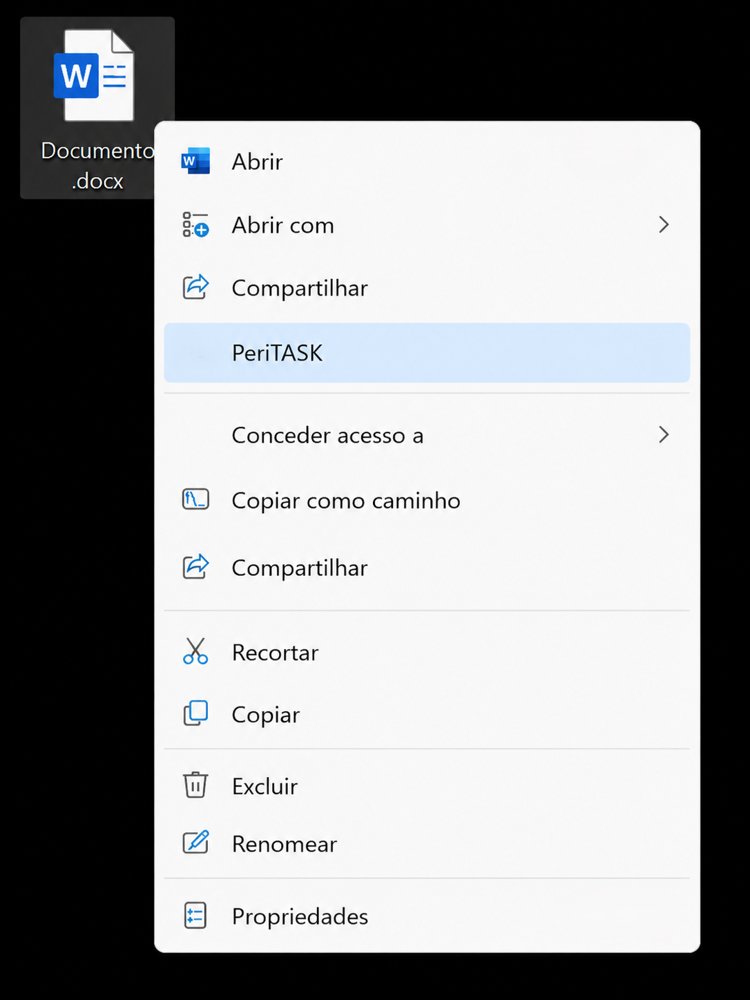

# PeriTASK

Ferramenta modular para automatizar e agilizar tarefas periciais.

  

---

## 📌 Visão Geral

O **PeriTASK** é um sistema modular desenvolvido para facilitar o processamento de arquivos e a execução de rotinas técnicas em Python.

O projeto combina:

- Interface gráfica (C#)
- Scripts de processamento (Python)
- Integração com o Windows (menu de contexto)
- Instalador automatizado

---

## ⚙️ Funcionamento

Fluxo típico de uso:

1. Usuário clica com botão direito em um arquivo
2. Seleciona opção do PeriTASK
3. Interface é iniciada
4. Usuário interage com a interface (configurações, opções, etc.)
5. Script Python é executado
6. Resultado é gerado/apresentado

---

## 📋 Pré-requisitos

- Windows

---

## 🚀 Instalação

1. Baixe a versão mais recente na aba **Releases**
2. Execute o instalador

---

## 🖥️ Compatibilidade

Testado apenas em:

- Windows 10
- Windows 11

---

## 🧩 Estrutura do Projeto

O repositório é dividido em quatro módulos principais:

### 🔹 AddContextMenu
Responsável por integrar o sistema ao Windows.

- Adiciona opções no menu de clique direito
- Permite executar o PeriTASK diretamente sobre arquivos
- Implementado em C++ (COM/ATL)

---

### 🔹 UserInterface
Interface gráfica do usuário.

- Desenvolvida em C#
- Permite interação com o sistema
- Responsável por iniciar e controlar os processos

---

### 🔹 PythonScript
Camada de processamento.

- Contém scripts Python
- Executa as rotinas principais (ex: análise, processamento, etc.)
- Pode utilizar bibliotecas como NumPy, OpenCV, etc.

---

### 🔹 Instalador
Responsável pela distribuição do programa.

- Utiliza WiX Toolset
- Compilação do código Python utilizando Nuitka
- Configura ambiente e integrações automaticamente

---

## 🧪 Status do Projeto

🚧 Em desenvolvimento

- Versões beta lançada.

---

## 📌 Versionamento

O projeto segue versionamento semântico:

- `v0.x` → versões em desenvolvimento
- `v1.0.0` → primeira versão estável

---

## 👥 Aos contribuidores

- Recomenda-se o uso do Microsoft Visual Studio
- Compilação depende de:
	- [WiX Toolset v3 Build Tools](https://github.com/wixtoolset/wix3/releases/latest)
	- Python em PythonScript\venv com as bibliotecas listadas em PythonScript\requirements.txt
- O desenvolvimento foi realizado em:
	- Visual Studio 2022
	- Python 3.13
   	- WiX Toolset v3.14

---
